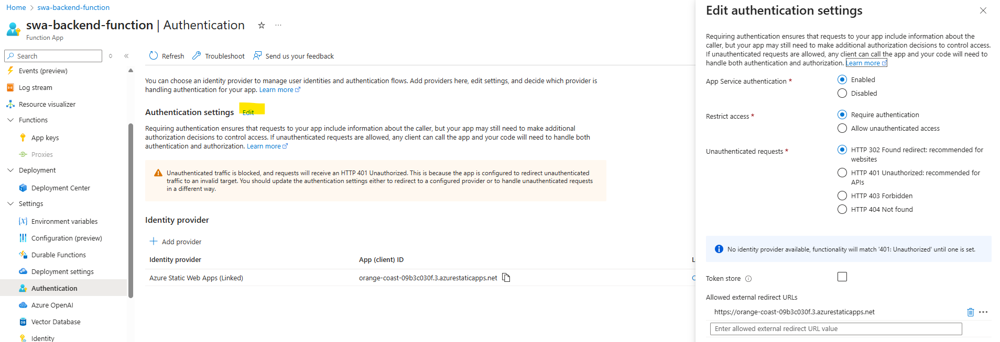
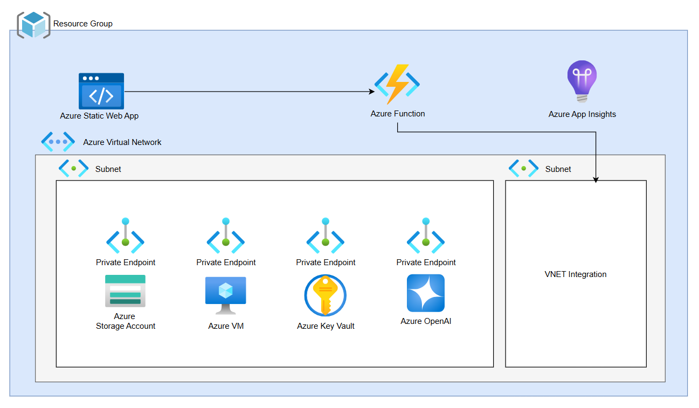

# Azure Static Web App

Questa repository contiene un esempio basilare di Azure Static Web App (nello specifico di una *Single Page Application*).

La soluzione realizzata si propone di esporre un frontend che permette un login ed a seguito del login eseguire due attività: upload di un file su storage account e interrogazione di  una istanza AI.
Il login è possibile appoggiandosi alle informazioni presenti all'interno di un indice Elasticsearch.

La soluzione completa si basa su due repository:

- *questa* in cui è possibile trovare il codice del frontend, le modalità di test e deploy del frontend ed il deploy delle risorse su Azure
- [Azure Function Backend](https://github.com/lcalcaterra/azurefunction-fastapi-backend) in cui è possibile trovare il codice di backend per interrogare le varie risorse e dare funzionalità al frontend.


## La Static Web App

La Web App può essere creata da zero clonando la repository indicata [qui](https://learn.microsoft.com/en-us/azure/static-web-apps/get-started-portal?tabs=react&pivots=github) oppure si può modificare il codice di questa repository. Se si dedice per la seconda opzione cambiare il puntamento alla repository.

Eseguire questi step per installare le componenti necessarie:

1. Installare npm: `npm install`
2. Fare le modifiche
3. Testare le modifiche: `npm run dev`
4. Ripetere step 2 e 3 fino a che il codice non è corretto

Fare il push della repository **prima** di creare la risorsa Azure. La risorsa può essere creata riprendendo [questo](https://learn.microsoft.com/en-us/azure/static-web-apps/get-started-portal?tabs=react&pivots=github) documento.

I push aggiornano anche l'applicazione ma dev'essere presente il file `.github/workflows/*.yml` all'interno della repository, altrimenti questo processo non funzionerà. Questa cartella permette di creare una GitHub Action che esegue questa attività.

**NB:** nel caso di applicazioni **React/Vite**, il file `.yml` dev'essere modificato indicando come *output location* ```dist``` anziché *build*, questo perché con Vite il pacchetto ha questo nome.
```
output_location: "dist"
```

In seguito al deploy dev'essere collegata la Function App in modo tale che possa essere utilizzata in maniera sicura dalla Static Web App di frontend.
Dalla sezione **Settings** > **API** della Web App è possibile creare il collegamento.


## La Azure Function

La Azure Function deve prevedere l'abilitazione dei **CORS** per il traffico locale e dalla Static Web App.

La Azure Function supporto l'utilizzo delle variabili d'ambiente tramite la sezione *Env Vars* del portale; tuttavia, è importante definirle **prima** di fare deploy del codice, altrimenti non si vedrà un errore tra i log ma ci sarà un errore (fidati) e non si vedrà alcuna function deployata.

Una volta collegata la Static Web App, sarà visibile nella sezione **Authentication** della Function App. Inoltre, sarà possibile impostare l'autenticazione in modo tale che la function non sia raggiungibile da altri servizi al di fuori della Static Web App, rendendo il backend sicuro.



## L'architettura

L'architettura da realizzare è riportata in questa immagine.


In aggiunta, è presente un [documento](risorse.xlsx) dedicato ai costi ed alle specifiche risorse per realizzare una applicazione simile utilizzata da pochi utenti.